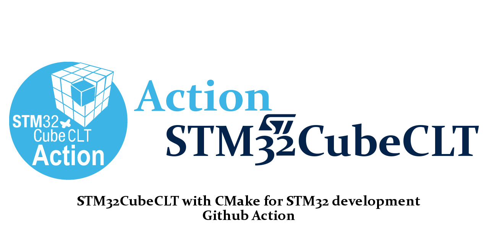

<!-- markdownlint-disable MD033 MD041 -->
<p align="center">
  
</p>

<p align="center">
  <a href="https://github.com/uoohyo/action-stm32-cmake/actions/workflows/sync-versions.yml"></a>
  <a href="https://github.com/uoohyo/action-stm32-cmake/releases"></a>
  <a href="LICENSE"></a>
  <a href="https://github.com/uoohyo/docker-stm32-cmake/blob/main/docs/versions.md"></a>
  <a href="https://hub.docker.com/r/uoohyo/stm32-cmake"></a>
</p>
<!-- markdownlint-enable MD033 MD041 -->

The [action-stm32-cmake](https://github.com/uoohyo/action-stm32-cmake) GitHub Action provides an automated environment for building STM32 projects using CMake and the [STM32CubeCLT](https://www.st.com/en/development-tools/stm32cubeclt.html) (STMicroelectronics Command Line Tools). This action facilitates continuous integration and delivery (CI/CD) for embedded STM32 projects, leveraging pre-built Docker images with all necessary tools pre-installed.

## Overview

This action uses **pre-built Docker images** from [docker-stm32-cmake](https://github.com/uoohyo/docker-stm32-cmake) with STM32CubeCLT already installed. Build time is typically **1–3 minutes** for pulling the image and building your project.

> **Note:** This action runs inside a Docker container and requires a **Linux** runner (e.g. `ubuntu-22.04`).

Supported STM32CubeCLT versions: **v1.11.1 – v1.21.0** (see [available versions](https://github.com/uoohyo/docker-stm32-cmake/blob/main/docs/versions.md))

## Usage

To use this action in your workflow, add the following steps to your `.github/workflows` YAML file:

```yaml
name: Build STM32 CMake Project

on:
    push:
        branches: [ main ]
    pull_request:
        branches: [ main ]

jobs:
    build:
        runs-on: ubuntu-22.04
        steps:
        - uses: actions/checkout@v4
        - name: Build with STM32CubeCLT
          uses: uoohyo/action-stm32-cmake@v1.21.0
          with:
              project-path: 'firmware'
              build-config: 'Release'
              build-target: 'all'
```

## Selecting a STM32CubeCLT Version

The STM32CubeCLT version is determined by the **action tag** you specify. Each tag corresponds to a specific STM32CubeCLT version from [docker-stm32-cmake](https://github.com/uoohyo/docker-stm32-cmake).

### Version Tag Examples

```yaml
# Use a specific STM32CubeCLT version (recommended for reproducible builds)
- uses: uoohyo/action-stm32-cmake@v1.21.0

# Use the latest patch version within v1.21.x
- uses: uoohyo/action-stm32-cmake@v1.21

# Use the latest minor version within v1.x
- uses: uoohyo/action-stm32-cmake@v1
```

### Available Versions

See the full list of supported STM32CubeCLT versions in [docker-stm32-cmake/docs/versions.md](https://github.com/uoohyo/docker-stm32-cmake/blob/main/docs/versions.md) or check the [releases page](https://github.com/uoohyo/action-stm32-cmake/releases).

## Inputs

### project-path (required)

The relative path from the repository root to the CMake project directory containing `CMakeLists.txt`. This path is resolved against the repository root (`/github/workspace`) inside the Docker container.

```yaml
with:
    project-path: 'path/to/cmake/project'
```

### build-config (optional)

The CMake build type/configuration. Common values include `Debug` or `Release`.

```yaml
with:
    build-config: 'Release'  # Optional, defaults to 'Debug'
```

Default Value: If not specified, the build configuration defaults to `Debug`.

### build-target (optional)

The CMake build target to compile. Use `all` to build all targets, or specify a specific target name defined in your `CMakeLists.txt`.

```yaml
with:
    build-target: 'firmware.elf'  # Optional, defaults to 'all'
```

Default Value: If not specified, the build target defaults to `all`.

### cmake-args (optional)

Additional CMake arguments to pass during configuration. Useful for defining custom variables, toolchain files, or other CMake options.

```yaml
with:
    cmake-args: '-DCMAKE_TOOLCHAIN_FILE=../cmake/stm32-gcc.cmake -DTARGET_MCU=STM32F407VG'
```

Default Value: If not specified, no additional arguments are passed to CMake.

## Included Tools

The Docker image includes the following tools from STM32CubeCLT:

| Component               | Description                                    |
| ----------------------- | ---------------------------------------------- |
| **STM32CubeMX**         | STM32 initialization code generator            |
| **STM32CubeProgrammer** | STM32 programming and debugging tool           |
| **GNU ARM Toolchain**   | arm-none-eabi-gcc for ARM Cortex-M compilation |
| **CMake**               | Build system generator (v3.22+)                |
| **Ninja**               | Fast build system                              |
| **Git**                 | Version control                                |

## Example Workflows

### Basic CMake Build

```yaml
- uses: uoohyo/action-stm32-cmake@v1.21.0
  with:
    project-path: 'firmware'
    build-config: 'Debug'
```

### Multi-Target Build

```yaml
- uses: uoohyo/action-stm32-cmake@v1.21.0
  with:
    project-path: 'firmware'
    build-config: 'Release'
    build-target: 'bootloader.elf'
```

### Custom Toolchain

```yaml
- uses: uoohyo/action-stm32-cmake@v1.21.0
  with:
    project-path: 'firmware'
    build-config: 'Release'
    cmake-args: '-DCMAKE_TOOLCHAIN_FILE=cmake/toolchain-arm.cmake'
```

### Matrix Build (Multiple Configurations)

```yaml
jobs:
  build:
    runs-on: ubuntu-22.04
    strategy:
      matrix:
        config: [Debug, Release]
        target: [firmware.elf, bootloader.elf]
    steps:
      - uses: actions/checkout@v4
      - name: Build ${{ matrix.target }} (${{ matrix.config }})
        uses: uoohyo/action-stm32-cmake@v1.21.0
        with:
          project-path: 'embedded'
          build-config: ${{ matrix.config }}
          build-target: ${{ matrix.target }}
```

## Notes

### Build Directory

The action creates a `build/` directory inside your project path for CMake output. Build artifacts (`.elf`, `.bin`, `.hex` files) will be located in `<project-path>/build/` after the build completes.

### CMake Generator

This action uses **Ninja** as the CMake generator for faster builds. Your project does not need to specify the generator in `CMakeLists.txt` — the action handles this automatically.

### Git Submodules

If your project uses Git submodules, ensure you check them out before running the build:

```yaml
- uses: actions/checkout@v4
  with:
    submodules: true
```

## License

[MIT License](./LICENSE)

Copyright (c) 2026 [uoohyo](https://github.com/uoohyo)

Permission is hereby granted, free of charge, to any person obtaining a copy
of this software and associated documentation files (the "Software"), to deal
in the Software without restriction, including without limitation the rights
to use, copy, modify, merge, publish, distribute, sublicense, and/or sell
copies of the Software, and to permit persons to whom the Software is
furnished to do so, subject to the following conditions:

The above copyright notice and this permission notice shall be included in all
copies or substantial portions of the Software.

THE SOFTWARE IS PROVIDED "AS IS", WITHOUT WARRANTY OF ANY KIND, EXPRESS OR
IMPLIED, INCLUDING BUT NOT LIMITED TO THE WARRANTIES OF MERCHANTABILITY,
FITNESS FOR A PARTICULAR PURPOSE AND NONINFRINGEMENT. IN NO EVENT SHALL THE
AUTHORS OR COPYRIGHT HOLDERS BE LIABLE FOR ANY CLAIM, DAMAGES OR OTHER
LIABILITY, WHETHER IN AN ACTION OF CONTRACT, TORT OR OTHERWISE, ARISING FROM,
OUT OF OR IN CONNECTION WITH THE SOFTWARE OR THE USE OR OTHER DEALINGS IN THE
SOFTWARE.
